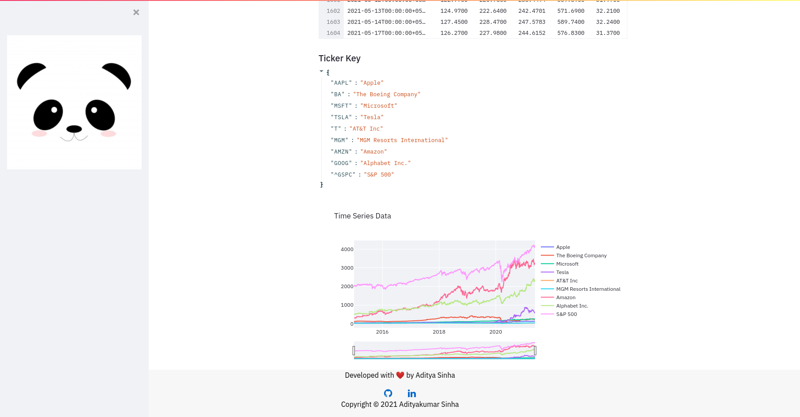

# Capital-Asset-Pricing-Model

## Installation
  ```bash
   $ pip3 install -r requirements.txt 
  ```
 
## Run
```bash
   $ streamlit run CAPM.py
```


## Description


A web app made using Streamlit and CSS that does CAPM analysis on real time stock data from Yahoo Finance.
Includes live time series analysis of stocks.
Calculates the returns of various portfolio combinations.

## Some Theory
<div>
  <ul>
  <li>CAPM provides a useful measure that helps investors determine what return they deserve on an investment, in exchange for putting their money at risk on it.  </li>
  <li>It describes the relationship between systematic risk and expected return for assets, particularly stocks. </li>
    <li>Investors expect to be compensated for risk and the time value of money. The risk-free rate in the CAPM formula accounts for the time value of money. </li>
    <li>The goal of the CAPM formula is to evaluate whether a stock is fairly valued when its risk and the time value of money are compared to its expected return. </li>
  </ul>
 </div>


## Dem

<div align="center">
  
</div>
